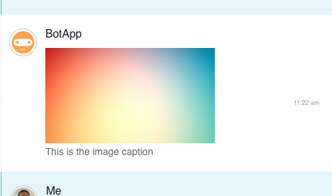
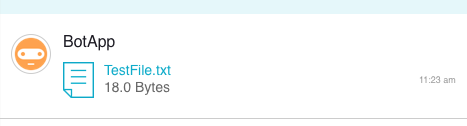
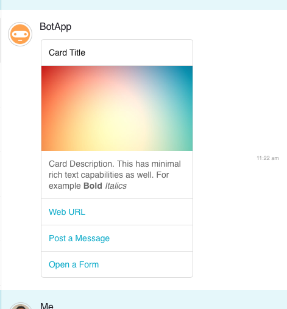

# Avaamo C# Bot SDK

Before start developing a bot you should first create a bot in the Avaamo Dashboard.
Follow the steps in this [Getting Started](https://github.com/avaamo/java/wiki) page to create a bot in the dashboard.

#### Download and add library
Avaamo C# Bot SDK is a single nuget package file, Avaamo.1.0.0.0.nupkg

[ Download ](https://github.com/avaamo/c-sharp/blob/master/Avaamo.1.0.0.0.nupkg?raw=true) SDK

#### Sample Bot

This [file](https://github.com/avaamo/c-sharp/blob/master/bot_sample.cs?raw=true) has the full C# code for Bot implementation.

#### Receiving Messages

```c#
using Avaamo;

```
Initialize the library with your BOT UUID and Access Token.

```c#

static void Main(string[] args)
{
    Avaamo.Client avaamo = new Avaamo.Client(<YOUR-BOT-UUID>, <YOUR-BOT-ACCESS-TOKEN>);
    // Handle incoming messages
    avaamo.MessageHandeler += new Avaamo.MessageHandeler(ProcessMessage);
    // Handle incoming message read acknowledgment
    avaamo.ReadAckHandler += new Avaamo.ReadAckHandler(ProcessReadAck);
    // Assign User Visited handler
    avaamo.UserVisitedHandler += new Avaamo.UserVisitedHandler(HandleOnUserVisited);
    //Connect avaamo client
    avaamo.Connect();
}

static void ProcessMessage(object sender, Avaamo.MessageArgs e)
{
    Avaamo.IncomingMessage incoming_message = e.Message();
    Avaamo.Message message = incoming_message.message;
    Avaamo.Conversation conversation = message.conversation;
    Console.WriteLine("Got Message");
    Console.WriteLine(message);
    Avaamo.Client avaamo = e.Client();
    Console.WriteLine(message.content);
}

static void ProcessReadAck(object sender, Avaamo.ReadAckArgs e)
{
    Console.WriteLine("ACK received");
    Avaamo.ReadAckModel ackModel = e.ReadAckModel();
    Console.WriteLine("User "+ackModel.user.firstName+" has read the message: "+ack_model.read_ack.message_uuid);
}

static void HandleOnUserVisited(object sender, Avaamo.UserActivityArgs e)
{
    var activity = e.UserActivity();
    var client = (Avaamo.Client)sender;
    Console.WriteLine("User "+  activity.user.firstName + "has visited the bot.");
}

```
#### Sending Text Messages

```c#
// message is the JSON string
avaamo.SendTextMessage(conversation, "Hello");
```

#### Sending an image

```c#
Avaamo.Image img = new Avaamo.Image("C:\\Users\\User1\\Downloads\\rocket.jpg");
img.setCaption("This is the image caption");
avaamo.SendAttachment(conversation, img);
```


#### Sending a file

```c#
Avaamo.File file = new Avaamo.File("C:\\Users\\User1\\Downloads\\TestFile.txt");
avaamo.SendAttachment(conversation, file);
```


#### Sending a card

```c#
Avaamo.Card card = new Avaamo.Card("Card Title", "Card Description. This has minimal rich text capabilities as well. For example <b>Bold</b> <i>Italics</i>");
card.addShowCaseImage("C:\\Users\\User1\\Downloads\\rocket.jpg");

// Web page link
Avaamo.Links.Web web_link = new Avaamo.Links.Web("Google", "https://google.com");
card.addLink(web_link);

//Send Message Link
Avaamo.Links.SendMessage message_link = new Avaamo.Links.SendMessage("Post Message", "Sample Message");
card.addLink(message_link);

//Form link
Avaamo.Links.FormLink form_link = new Avaamo.Links.FormLink("Submit Form", "d6c32cd0-a092-4f5b-dd68-ec5eb2049b82", "Form Name");
card.addLink(form_link);

avaamo.SendCard(conversation, card);

```


